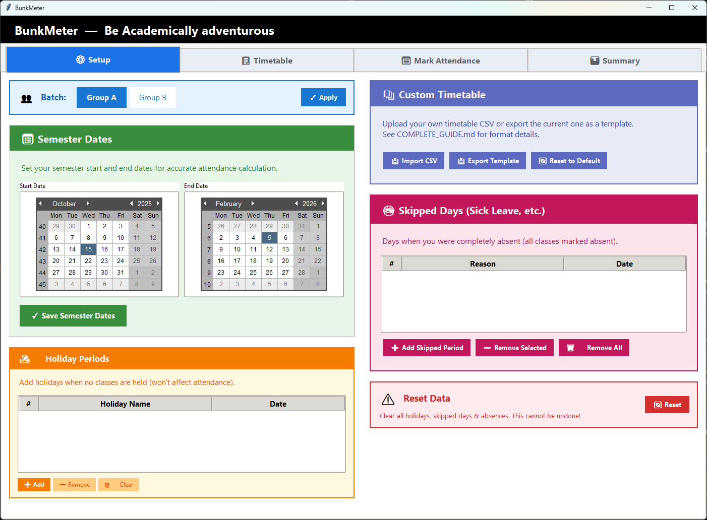
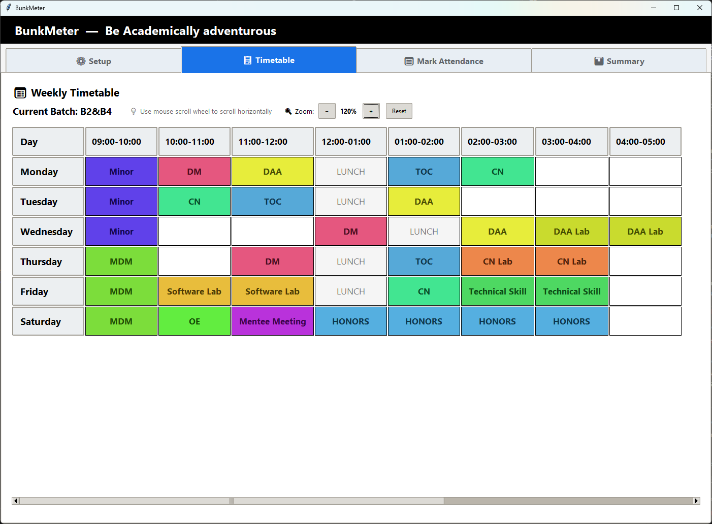
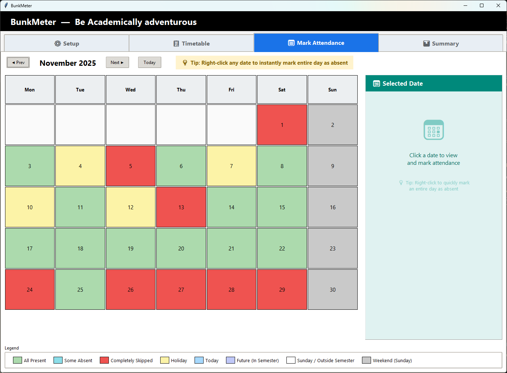
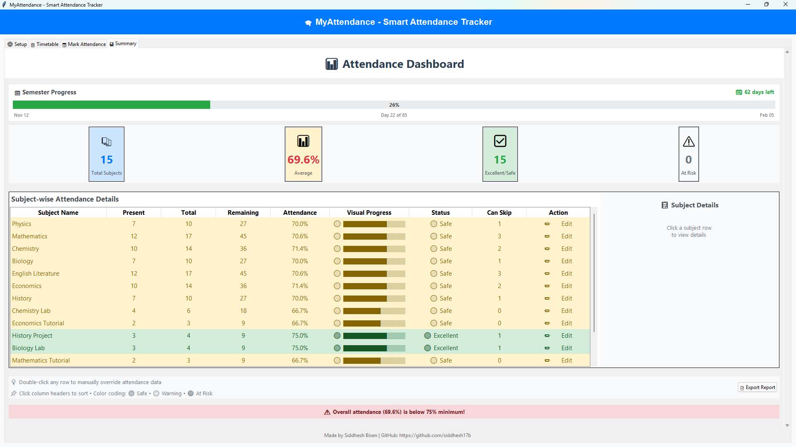

# Complete Guide - BunkMeter

A step-by-step walkthrough of every feature in the app.

---

## First Launch - Setup Wizard

When you run the app for the first time, a setup wizard appears:

### Step 1: Import Timetable (Optional)
- Click **"📥 Import Timetable CSV"** to upload your custom schedule
- Or skip this to use the default timetable
- If you import, batch options will auto-detect from your CSV

### Step 2: Select Your Batch
- Choose your batch/group (B1/B3, B2/B4, or custom names from CSV)
- Click **"Continue"**

The app opens with 4 tabs. Let's go through each one.

---

## Tab 1: ⚙️ Setup

This tab is split into left and right columns.



### Left Column

#### Batch Selection
- Radio buttons showing available batches
- Select your batch and click **"Update Batch"**
- Changing batch will recalculate all subjects

#### Semester Dates
- Two calendar widgets side by side
- **Left calendar**: Semester start date
- **Right calendar**: Semester end date
- Click **"Save Dates"** after selecting both

#### Holiday Periods
- List of all holidays with serial numbers (Diwali break, exam week, etc.)
- **"➕ Add Holiday Period"** → Opens dialog:
  1. Enter holiday name
  2. Pick start date from calendar
  3. Pick end date from calendar
  4. Click **"Save"** - Each day added as separate entry
- **"➖ Remove Selected"** → Select a holiday and delete it
- **"🗑️ Remove All"** → Clear all holidays at once (with confirmation)
- Holidays don't count toward attendance (excluded from total)
- ⚠️ Holidays must be within semester dates

### Right Column

#### Custom Timetable Management
- **"📥 Import Custom Timetable"** → Upload CSV file
  - ⚠️ This resets ALL attendance data (confirms first)
  - Subjects and batch options update automatically
- **"📤 Export Timetable Template"** → Download current timetable as CSV
  - Use this as a template to edit
- **"🔄 Reset to Default"** → Delete custom timetable, use built-in default

#### Skipped Days (Sick Leave, etc.)
- Track periods when you were completely absent
- List shows serial numbers, reason, and date
- **"➕ Add Skipped Period"** → Opens dialog:
  1. Enter reason (Sick, Personal, etc.)
  2. Pick start date
  3. Pick end date
  4. Click **"Save"**
  - ⚠️ All classes in this period are auto-marked absent
  - ⚠️ Skips dates that are already holidays
- **"➖ Remove Selected"** → Removes period AND restores ALL attendance marks
- **"🗑️ Remove All"** → Clear all skipped days and restore marks (with confirmation)

**Automatic Sync:**
- When you mark ALL subjects absent via calendar → automatically added here
- When you mark ANY subject present on a skipped day → automatically removed from here

#### Reset Data
- **"🔄 Reset All Data"** → Clears:
  - All holidays
  - All skipped days
  - All absent dates
  - All manual overrides
- Keeps: Batch selection and semester dates

---

## Tab 2: 📋 Timetable

Read-only display of your weekly schedule.



### Layout
- Rows: Monday to Saturday
- Columns: Time slots (dynamic - shows all times from your timetable)
- Each cell shows the subject for that day/time

### Zoom Controls
- **"−"** button to zoom out (minimum 60%)
- **"+"** button to zoom in (maximum 160%)
- **"Reset"** button to return to 100%
- Zoom affects font sizes, cell padding, and column widths

### Colors
- Each subject gets a unique color (hash-based algorithm)
- Same subject = same color everywhere
- "LUNCH" cells are gray
- Colors are vibrant (high saturation) for easy distinction

### Notes
- Saturday is treated as a working day (has classes)
- Only Sunday is a weekend
- Batch-specific subjects show only for your selected batch
- Use mouse wheel to scroll horizontally when timetable is wide

---

## Tab 3: 📅 Mark Attendance (Main Tab)

Google Calendar-style monthly grid.



### Navigation
- **"◀ Prev"** → Previous month
- **"Next ▶"** → Next month
- **"Today"** → Jump to current month

### Calendar Colors
| Color | Meaning |
|-------|---------|
| 🟢 Soft Green | All classes present |
| 🩵 Cyan | Some classes absent |
| 🔴 Dark Red | Completely skipped (all absent) |
| 🟡 Yellow | Holiday |
| 🔵 Light Blue | Today |
| ⚪ White | Future (outside semester) |
| 🟣 Soft Purple | Future (within semester) |
| ⬜ Light Gray | Sunday (no classes) |

### Left-Click a Date
Opens side panel with:

1. **Date header** - Shows "December 04, 2024 (Wednesday)"
2. **Close button (✕)** - Clears selection
3. **"🏖️ Mark as Holiday"** button - Toggle this day as holiday
4. **Checkboxes for each subject**:
   - ✅ Checked = Present (default)
   - ⬜ Unchecked = Absent
   - If a subject has multiple classes that day, shows:
     - "Physics Lab (Class #1)"
     - "Physics Lab (Class #2)"
5. **"💾 Save Attendance"** button - Saves your changes

### Right-Click a Date
Quick toggle for entire day:
- **Right-click normal day** → Marks ALL subjects absent (completely skipped)
- **Right-click skipped day** → Marks ALL subjects present (removes absences)
- Also adds/removes entry in "Skipped Days" list in Setup tab

### Calendar ↔ Setup Sync
The calendar and Setup tab's "Skipped Days" are automatically synchronized:
- **Right-click to skip** → Entry appears in Setup tab
- **Right-click to un-skip** → Entry removed from Setup tab
- **Uncheck ALL subjects & save** → Entry added to Setup tab
- **Check ANY subject on skipped day & save** → Entry removed from Setup tab
- **Remove from Setup tab** → All absence marks restored in calendar

### Restrictions
- ❌ Cannot mark future dates (shows info message)
- ❌ Cannot mark dates outside semester period

---

## Tab 4: 📊 Summary (Dashboard)

Your attendance headquarters.



### Semester Progress Bar
- Visual bar showing semester completion %
- Color changes: 🟢 Green (0-50%) → 🟡 Yellow (50-75%) → 🔴 Red (75-100%)
- Shows **"📆 X days left"** badge with urgency colors:
  - Green: More than 30 days left
  - Orange: 14-30 days left
  - Red: Less than 14 days left

### Stats Cards (Top Row)
| Card | Shows |
|------|-------|
| 📚 Total Subjects | Number of subjects |
| 📊 Average | Overall attendance % (75% threshold) |
| ✅ Excellent/Safe | Subjects at 60%+ |
| ⚠️ At Risk | Subjects below 60% |

### Subject Table
| Column | Meaning |
|--------|---------|
| Subject | Subject name |
| Attended | Classes you attended |
| Total | Classes held so far |
| Remaining | Future classes till semester end |
| Percentage | Your attendance % |
| Progress | Visual bar with 🟢🟡🔴 |
| Status | 🟢 Excellent (≥75%) / 🟡 Safe (60-74%) / 🔴 At Risk (<60%) |
| Can Skip | How many more you can miss |
| Action | "✏️ Edit" or "📝 Manual" if override active |

### Sorting
- Click any column header to sort
- Click again to reverse order

### Subject Details Panel (Right Side)
**Single-click any row** to see detailed info in the side panel:

**Header:**
- Subject name (large, bold)
- Close button (✕) to hide panel

**Statistics Section:**
- Classes Attended: X / Y
- Attendance: XX.X%
- Can Skip: X classes
- Weekly Count: Xx/week
- ⚠️ Warning if manual override is active

**Status Indicator:**
- 🟢 **Excellent** (≥75%)
- 🟡 **Safe** (60-74%)
- 🔴 **At Risk** (<60%)

**Absent Dates List:**
- Scrollable list of all dates you were absent
- Shows most recent 15 dates
- Format: "• Dec 04, 2024 (Wed)"

**Recovery Calculation (At Risk only):**
- Shows: "📈 Need X more classes without absence to reach 60%"

**Edit Button:**
- **"✏️ Edit Attendance"** - Opens manual override dialog

### Manual Override
**Double-click any row** to open override dialog:

1. Shows current calculated values
2. Enter **Total Classes Held** (actual number)
3. Enter **Classes Attended** (actual number)
4. Click **"💾 Save Override"**

Use this when:
- Professor cancelled classes
- Extra classes were held
- You attended makeup classes
- Timetable doesn't match reality

To remove override:
- Double-click subject
- Click **"🔄 Clear Override"**

### Export Report
- Click **"📄 Export Report"** button
- Saves `attendance_report_YYYYMMDD_HHMMSS.txt` file
- Contains all subjects with present/total/percentage/status

---

## Custom Timetable Format

### Template Files Included
Two ready-to-use templates are included:

| Template | Description |
|----------|-------------|
| `timetable_template_simple.csv` | Standard hourly slots (09:00-10:00), your actual college timetable |
| `timetable_template_flexible.csv` | Custom time slots (07:30-09:00, 08:30-10:00), Group A/B batches |

### CSV Structure (3 columns with header)
```
Day,Time,Subject
MONDAY,09:00-10:00,Mathematics
```

### Example
```
Day,Time,Subject
MONDAY,09:00-10:00,Mathematics
MONDAY,10:00-11:00,Physics
MONDAY,11:00-12:00,Lunch
MONDAY,02:00-04:00,CN Lab (B1&B3) / DAA Lab (B2&B4)
TUESDAY,09:00-10:00,Chemistry
TUESDAY,10:00-12:00,Software Lab (Group A) / Hardware Lab (Group B)
```

### Rules

| Element | Requirement |
|---------|-------------|
| Day | UPPERCASE: MONDAY, TUESDAY, WEDNESDAY, THURSDAY, FRIDAY, SATURDAY |
| Time | Any format: 09:00-10:00, 9-10, 0900-1000, 2:00 PM-4:00 PM |
| Subject | Any name - kept exactly as entered |
| Lunch | Name it "Lunch" - automatically skipped |
| Batches | Format: `Subject1 (Batch1) / Subject2 (Batch2)` |

### Batch-Specific Classes
For classes that differ by batch:
```
CN Lab (B1&B3) / DAA Lab (B2&B4)
```
- If you select B1&B3 → Shows "CN Lab"
- If you select B2&B4 → Shows "DAA Lab"

Batch names are auto-detected from parentheses in your CSV.

---

## The Attendance Thresholds

### Dual Threshold System
- **60% minimum per subject** - Each subject must stay above 60%
- **75% overall attendance** - Your average across all subjects must stay above 75%

### Safe to Skip Calculation (60% threshold for subjects)
```
Safe to Skip = floor((Attended - 0.60 × Total) / 0.40)
```

### Example
- Attended: 30 classes
- Total: 36 classes
- Calculation: (30 - 21.6) / 0.40 = 21
- **Result: You can skip 21 more classes and still be at 60%**

### Recovery Calculation (When Below 60%)
```
Classes Needed = ceil((0.60 × Total - Attended) / 0.40)
```

### Example
- Attended: 20 classes
- Total: 36 classes
- Current: 55.6%
- Calculation: (21.6 - 20) / 0.40 = 4
- **Result: Need 4 more classes without absence to reach 60%**

---

## Mouse & Keyboard Actions

| Action | How |
|--------|-----|
| Mark single subjects absent | Left-click date → Uncheck subjects → Save |
| Mark entire day absent | Right-click date |
| Mark entire day present | Right-click already-skipped date |
| View subject details | Single-click row in Summary table |
| Override attendance | Double-click row in Summary table |
| Sort table | Click column header |
| Reverse sort | Click same header again |
| Scroll dashboard | Mouse wheel (when cursor outside table) |
| Scroll table | Mouse wheel (when cursor over table) |
| Navigate months | "◀ Prev" / "Next ▶" buttons |
| Jump to today | "Today" button |

---

## Data Files

| File | What It Stores | Safe to Delete? |
|------|----------------|-----------------|
| `data.json` | All attendance data, holidays, settings | ❌ NO - loses everything |
| `custom_timetable.json` | Your imported timetable | ✅ Yes - reverts to default |

### App Files (Don't modify)

| File | Purpose |
|------|---------|
| `app.py` | Main application entry point |
| `data_manager.py` | Handles data loading/saving and timetable management |
| `calculations.py` | Attendance math and safe-skip calculations |
| `setup_tab.py` | Setup tab UI and configuration |
| `timetable_tab.py` | Timetable display with color-coded subjects |
| `attendance_calendar.py` | Calendar-style attendance marking |
| `summary_tab.py` | Dashboard with stats and subject details |
| `modern_dialogs.py` | Custom Material Design-style dialogs |

### Backup
Copy `data.json` to backup your data.

### Full Reset
Delete both files and restart the app for fresh install.

---

## Troubleshooting

| Problem | Solution |
|---------|----------|
| App won't start | Run `pip install tkcalendar` |
| ModuleNotFoundError | Run from inside BunkMeter folder |
| Wrong attendance % | Check semester dates in Setup tab |
| Subject missing | Import timetable with your subjects |
| "0 classes" everywhere | Semester hasn't started yet |
| "Remaining" shows 0 | Semester ended or date calculation issue |
| Import fails | Check CSV format - days UPPERCASE, header required |
| Batch not appearing | CSV needs format: `Subject (BatchName)` |
| Future dates locked | By design - can't mark future attendance |
| Scroll not working | Move cursor to table area for table scroll |
| Dialog looks wrong | All dialogs use modern Material Design style |
| Want fresh start | Setup Tab → Reset Data |
| Complete reset | Delete data.json + custom_timetable.json |

---

## Tips

1. **Mark absences daily** - Easier than remembering later
2. **Use right-click** for sick days - Faster than clicking each subject
3. **Check "Can Skip"** before bunking - Know your limits
4. **Watch the overall warning** - Red banner appears if average drops below 75%
5. **Click subjects for details** - See absent dates and recovery calculation
6. **Export reports** before exams - Keep a record
7. **Backup data.json** monthly - Don't lose your data
8. **Double-click to fix** - Use override when timetable doesn't match reality
9. **Check semester progress** - Days remaining badge shows urgency
10. **Modern dialogs** - All popups use sleek Material Design styling with clear icons
11. **Error messages are helpful** - If something goes wrong, the app tells you exactly what

---

Made by **Siddhesh Bisen** • [GitHub](https://github.com/siddhesh17b)
